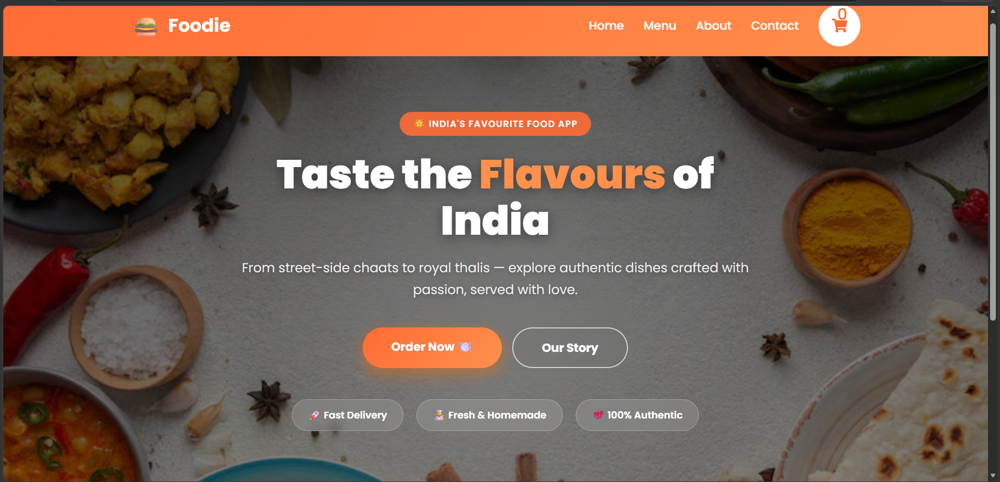
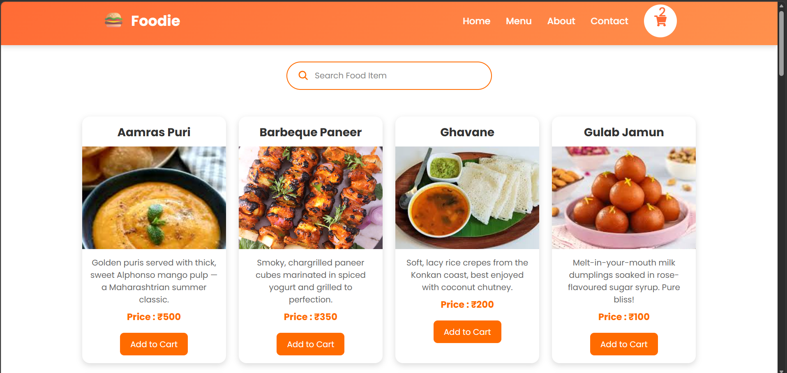
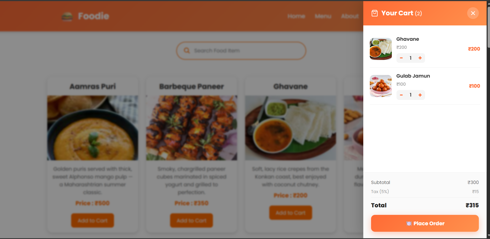
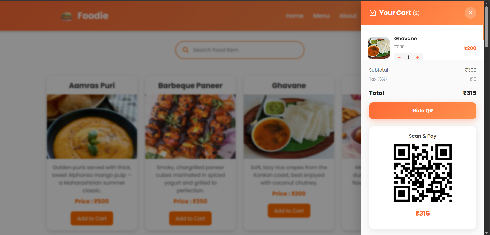
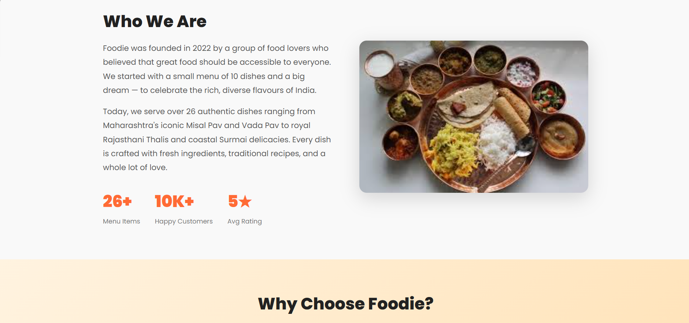
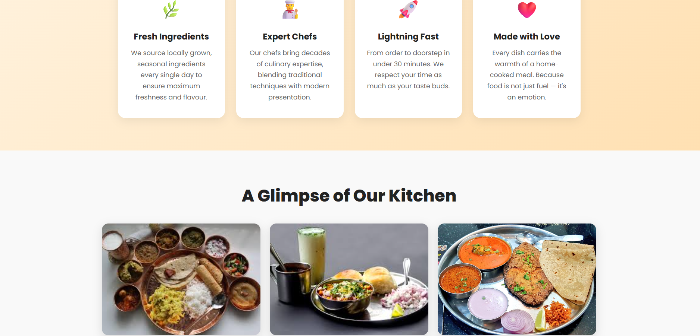
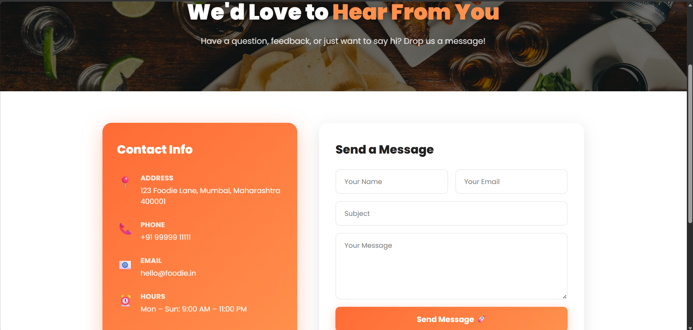
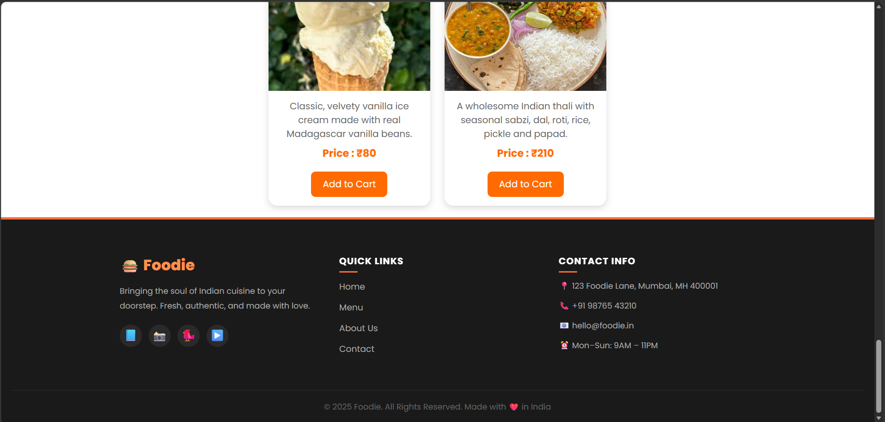

# 🍔 Foodie - Modern Food Ordering Web Application

Foodie is a modern and responsive food ordering web application built using **React.js** and **Vite**. It enables users to explore a variety of food items, search dishes in real time, manage a shopping cart, and simulate checkout using a QR code payment interface.

This project demonstrates modern frontend development practices including reusable React components, client-side routing, state management, responsive UI, and deployment using Vercel.

---

## 🌐 Live Demo

🔗 **https://foodie-nu-eight-40.vercel.app**

---

## ✨ Features

- 🍽️ Browse a variety of food items
- 🔍 Real-time search functionality
- 🛒 Add items to shopping cart
- ➕ Increase / Decrease item quantity
- ❌ Remove items from cart
- 💰 Automatic total price calculation
- 📱 QR Code payment interface
- ⚛️ Component-based React architecture
- 📱 Fully responsive design
- 🚀 Fast deployment with Vercel

---

# 📸 Screenshots

## 🏠 Home Page



---

## 🍽️ Menu



---

## 🛒 Shopping Cart



---

## 💳 QR Code Payment



---

## ℹ️ About



---

## 👨‍🍳 Kitchen



---

## 📩 Contact



---

## 🦶 Footer



---

# 🛠️ Tech Stack

### Frontend

- React.js
- Vite
- HTML5
- CSS3
- JavaScript (ES6)

### Libraries

- React Router DOM
- React Icons
- React QR Code

### Tools

- VS Code
- Git
- GitHub
- Vercel

---

# 📂 Project Structure

```text
Foodie/
│
├── screenshots/
│   ├── home.png
│   ├── menu.png
│   ├── about.png
│   ├── kitchen.png
│   ├── contact.png
│   ├── cart.png
│   ├── payment.png
│   └── footer.png
│
├── public/
│
├── src/
│   ├── assets/
│   ├── component/
│   │   ├── About/
│   │   ├── Card/
│   │   ├── CartSidebar/
│   │   ├── Contact/
│   │   ├── Footer/
│   │   ├── Home/
│   │   ├── Landing/
│   │   ├── Navbar/
│   │   └── NotFound/
│   │
│   ├── Routing/
│   ├── App.jsx
│   └── main.jsx
│
├── package.json
├── vite.config.js
└── README.md
```


# 🚀 Deployment

This project is deployed on **Vercel**.

Every push to the **main** branch automatically triggers a new production deployment.

---

# 💡 Learning Outcomes

Through this project I gained practical experience with:

- React Components
- React Hooks
- React Router
- State Management
- Props
- Event Handling
- Conditional Rendering
- Search Filtering
- Cart Management
- Responsive Web Design
- Git & GitHub Workflow
- Vercel Deployment

---

# 🔮 Future Improvements

- 🔐 User Authentication
- ❤️ Wishlist
- 📦 Order History
- 💳 Online Payment Gateway
- 🗂️ Product Categories
- ⭐ Product Ratings & Reviews
- 🌙 Dark Mode
- 🔔 Notifications
- 🐍 Django REST Framework (DRF) Integration
- 🗄️ MySQL Database
- 👨‍💼 Admin Dashboard

---

# 👨‍💻 Developer

**Mahendra Samant**

- GitHub: https://github.com/mahendra-samant

---

# ⭐ Show Your Support

If you found this project helpful or interesting, consider giving it a **⭐ Star** on GitHub.